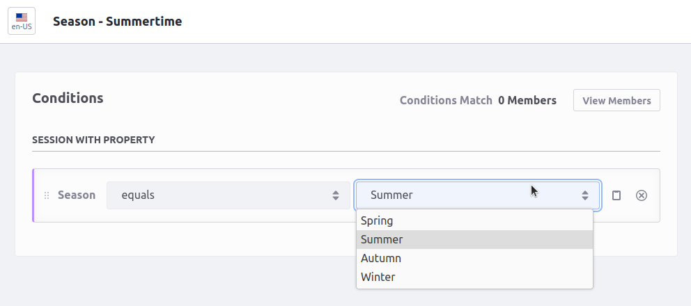

# Season Segment

Ever needed to demonstrate a custom segement provider?
With this custom module you can create custom experiences based on the season of the year.

This custom segment provider will be added to the 'Session' category.
It's currently supporting northern-season logic (above the equator).
If you are in the southern-season you can still use it but be aware of this.

## How to Build and Deploy to Liferay

Follow the steps below to build and deploy or copy the modules from the [releases](../../releases/latest) page to your Liferay's deploy folder.

In order to build or deploy this module you will need to [install Blade CLI](https://help.liferay.com/hc/en-us/articles/360028833852-Installing-Blade-CLI).

### To Build

`$ blade gw build`

You can find the built modules at `modules/{module-name}/build/libs/{module-name}.jar`.

### To Deploy

Simply download the jar from https://github.com/jverweijL/season-segment/releases/latest and deploy OR

In `gradle-local.properties` add the following line to point towards the Liferay instance you want to deploy to:
```
liferay.workspace.home.dir=/path/to/liferay/home
```

`$ blade gw deploy`


### Features

* Create custom experience based on season
  